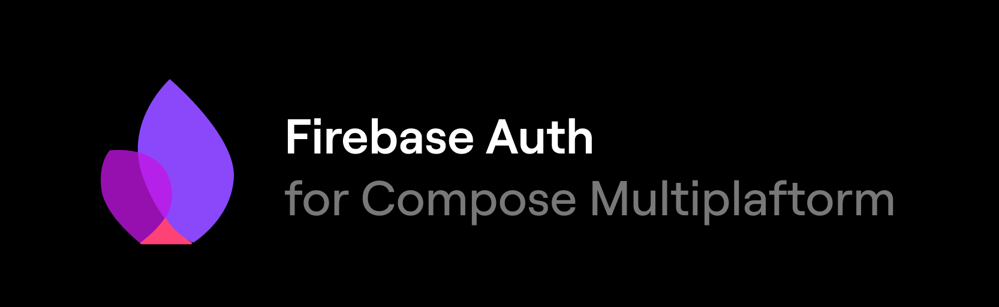

## Getting Started with FireComposeAuth

FireComposeAuth is a Kotlin Multiplatform library that simplifies Firebase Authentication integration for Android and iOS using Compose Multiplatform.

### Installation

#### 1. Add FireComposeAuth to your project

In your root `settings.gradle.kts`, include the module:

```kotlin
include(":firecomposeauth")
```

Then add it as a dependency in your shared module (`composeApp` for example):

```kotlin
implementation(project(":firecomposeauth"))
```

---

## Firebase Setup Instructions

### Android

1. Place your `google-services.json` inside your Android app module:
   ```
   sample/androidApp/google-services.json
   ```

2. Apply the Google Services plugin in `sample/androidApp/build.gradle.kts`:
   ```kotlin
   plugins {
       id("com.google.gms.google-services")
   }
   ```

3. Add the plugin to the root `build.gradle.kts`:
   ```kotlin
   dependencies {
       classpath("com.google.gms:google-services:4.4.0")
   }
   ```

---

### iOS

1. Place your `GoogleService-Info.plist` file inside your iOS app:
   ```
   sample/iosApp/GoogleService-Info.plist
   ```

2. Drag and drop the file into Xcode under the `iosApp` target.
   - Enable **"Copy if needed"**
   - Ensure it's added to the correct **Build Target**

3. Manually add Firebase SDKs via Swift Package Manager:
   - Open your Xcode project
   - Go to **File > Add Packages**
   - Use the URL: `https://github.com/firebase/firebase-ios-sdk`
   - Select `FirebaseAuth` and `FirebaseCore` packages---

## Usage

### 🔐 Available Authentication Methods

| Method                                   | Description                            | Sample Usage                                                   |
|------------------------------------------|----------------------------------------|----------------------------------------------------------------|
| `login(email, password)`                 | Sign in with email/password            | `fireComposeAuth.login("test@example.com", "secret")`          |
| `register(email, password)`              | Register a new user                    | `fireComposeAuth.register("test@example.com", "secret")`       |
| `sendPasswordResetEmail(email)`          | Send a password reset email            | `fireComposeAuth.sendPasswordResetEmail("test@example.com")`   |
| `deleteAccount()`                        | Delete current logged-in user          | `fireComposeAuth.deleteAccount()`                              |
| `reauthenticate(email, password)`        | Re-authenticate current user           | `fireComposeAuth.reauthenticate("test@example.com", "secret")` |
| `signInWithGoogle(idToken, accessToken)` | Sign in with Google                    | `fireComposeAuth.signInWithGoogle(idToken, accessToken)`       |
| `signInWithApple(idToken)`               | Sign in with Apple                     | `fireComposeAuth.signInWithApple(idToken)`                     |
| `logout()`                               | Sign out user                          | `fireComposeAuth.logout()`                                     |
| `currentUser()`                          | Returns current user info if logged in | `fireComposeAuth.currentUser()`                                |
| `updatePassword(newPassword)`           | Updates the user's password            | `fireComposeAuth.updatePassword("newStrongPassword123")`       |

---

### ⚙️ Token Retrieval (Native Setup Required)

#### Android (Google Sign-In)

1. Add dependency to your `build.gradle`:
   ```kotlin
   implementation("com.google.android.gms:play-services-auth:20.7.0")
   ```

2. Setup GoogleSignIn:
   ```kotlin
   val gso = GoogleSignInOptions.Builder(GoogleSignInOptions.DEFAULT_SIGN_IN)
       .requestIdToken("your-client-id-from-firebase")
       .requestEmail()
       .build()
   val client = GoogleSignIn.getClient(this, gso)
   ```

3. Launch and retrieve tokens:
   ```kotlin
   val account = GoogleSignIn.getSignedInAccountFromIntent(data).result
   val idToken = account.idToken
   val accessToken = account.serverAuthCode // exchange if needed
   ```

#### iOS (Apple Sign-In)

1. Use `ASAuthorizationAppleIDProvider`:
   ```swift
   let provider = ASAuthorizationAppleIDProvider()
   let request = provider.createRequest()
   request.requestedScopes = [.email]

   let controller = ASAuthorizationController(authorizationRequests: [request])
   controller.delegate = ...
   controller.presentationContextProvider = ...
   controller.performRequests()
   ```

2. Retrieve idToken:
   ```swift
   let credential = authorization.credential as? ASAuthorizationAppleIDCredential
   let idToken = String(data: credential?.identityToken ?? Data(), encoding: .utf8)
   ```

Then pass these tokens to your shared KMP auth module.

---

## Notes

- Don't include `google-services.json` or `GoogleService-Info.plist` inside the library.  
  These must remain in the **host application**.
- `initialize()` must be called **before using FirebaseAuth** or it will crash.

---

## Learn more

---

## 🔢 Firebase Auth Error Codes

| Code   | Constant                              | Description                          |
|--------|---------------------------------------|--------------------------------------|
| 17008  | `ERROR_INVALID_EMAIL`                | The email address is badly formatted |
| 17009  | `ERROR_WRONG_PASSWORD`               | Incorrect password                   |
| 17011  | `ERROR_USER_NOT_FOUND`               | No user found with this identifier   |
| 17010  | `ERROR_TOO_MANY_REQUESTS`            | Request blocked due to unusual activity |
| 17007  | `ERROR_EMAIL_ALREADY_IN_USE`         | Email already in use                 |
| 17026  | `ERROR_WEAK_PASSWORD`                | Password is not strong enough        |
| other  | `UNKNOWN`                            | Unrecognized error code              |

You can access these constants via `FirebaseAuthErrorCodes` from your shared codebase.

- [Kotlin Multiplatform](https://kotlinlang.org/lp/multiplatform/)
- [Firebase Authentication](https://firebase.google.com/docs/auth)
- [JetBrains Compose Multiplatform](https://www.jetbrains.com/lp/compose-multiplatform/)